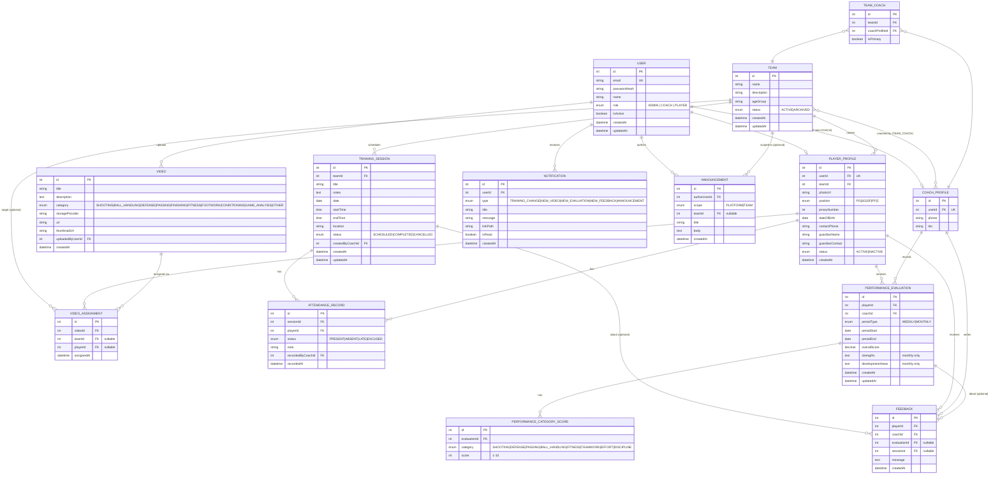
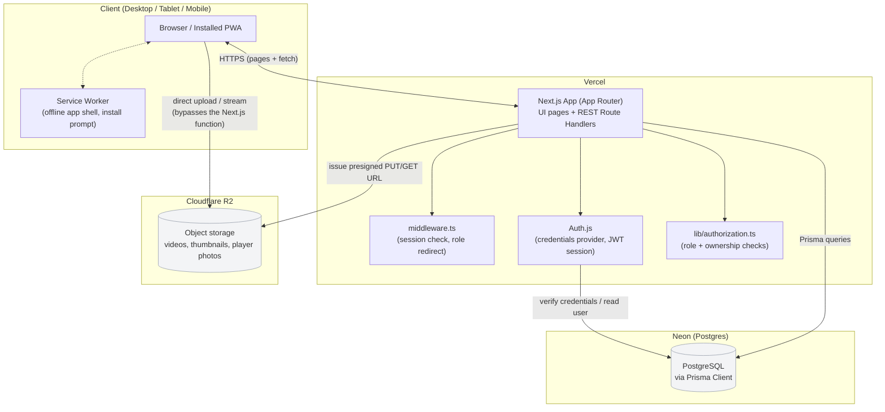

# Basketball Team Management & Player Development Platform — System Architecture

**Status:** Draft for review — no application code written yet.
**Source:** `Basketball_Platform_PRD.docx` (v1.0, 24 Aug 2026) + product brief in chat.
**Purpose:** Propose stack, data model, API shape, and repo layout; get sign-off before scaffolding.

---

## 1. Tech Stack

| Layer | Choice | Why |
|---|---|---|
| Frontend | **Next.js (App Router) + TypeScript + Tailwind CSS + shadcn/ui** | One codebase serves both UI and API — smallest surface area for a small team to build and deploy. Server components keep dashboards fast on low-end devices; App Router route groups map cleanly onto the three role-specific navigation trees the PRD lays out (§5.1). shadcn/ui gives accessible, themeable components without a heavy design-system dependency. |
| Backend | **Next.js Route Handlers (REST)**, same codebase | No separate service to deploy, version, or CORS-configure. Scales to "multiple teams/clubs/coaches" fine on Vercel's serverless functions; if a workload later needs to run outside the request/response cycle (video transcoding, AI analytics), it can be split out as a standalone worker without touching the rest of the app. |
| Auth | **Auth.js (NextAuth) v5**, credentials provider, JWT session | Battle-tested, free, and self-hosted (no per-user pricing as the platform grows across clubs). Session JWT is enriched with `role` and team/player scope so authorization checks don't need a DB round-trip on every request. |
| Database | **PostgreSQL via Prisma ORM**, hosted on **Neon** | Relational fits this domain well — teams, rosters, sessions, and evaluations are all foreign-key-heavy. Neon's branching (a full DB copy per PR/preview) and generous free tier keep costs at zero pre-revenue; pooled connections handle serverless's higher concurrent-connection count. Prisma gives type-safe queries and painless migrations for a small team. |
| Photo storage | **Cloudflare R2** (S3-compatible object storage) | Player photos and video thumbnails are small; R2 has no egress fees, which matters once players are regularly loading photos/videos on mobile data. |
| Video storage | **Cloudflare R2** for MVP, with **Mux** flagged as the upgrade path | Coaches uploading and players streaming video is exactly the workload Vercel's serverless functions are wrong for (execution time limits, payload size limits, bandwidth cost). R2 + browser-to-storage presigned uploads sidesteps all three cheaply. The trade-off: no adaptive bitrate, no per-second view analytics, no automatic thumbnails — R2 stores whatever file the coach uploads and the browser plays it directly. **Video progress tracking** and **AI performance analytics** (both post-MVP) are exactly the features a service like Mux is built for (watch-time webhooks, thumbnail generation, adaptive streaming) — moving to Mux later means swapping the storage adapter behind one interface, not a schema change, because `Video.url`/`Video.provider` already abstracts over "wherever the file lives." |
| Hosting / CI-CD | **Vercel** | Git-push deploys, preview environments per PR (paired with a Neon DB branch, same pattern as the existing tournament-app scaffold), zero server ops. |
| PWA | **Manifest + service worker** (installable, offline app shell) | Satisfies "responsive, usable on mobile" without building a native app now, and is a real stepping stone to the post-MVP "native mobile apps" item — the same Next.js app can later be wrapped (Capacitor) or have a React Native client built against the same REST API. |

**Deliberately not chosen for MVP:** GraphQL (see §3), a separate backend service (unnecessary ops overhead for one web client), Firebase/Supabase-style BaaS (less control over the relational modeling this domain needs, and a harder migration path off later).

---

## 2. Database Schema

### 2.1 Entity-relationship diagram



### 2.2 Notes on modeling decisions

- **Every Player is a User.** The PRD's permission matrix has players logging in to view their own attendance/performance/feedback, so unlike a public-registration product, there's no "roster entry without an account" case here — `PlayerProfile` and `CoachProfile` are 1:1 extensions of `User`, keyed by role.
- **A team can have multiple coaches; a coach can manage multiple teams** — `TEAM_COACH` is a join table (`isPrimary` flag distinguishes head coach from assistants), directly reflecting §6 of the PRD ("Coach → Teams").
- **A player belongs to exactly one team** for MVP (`PlayerProfile.teamId`), matching "Team → Players" in the PRD's data-relationships section. No multi-team join table is introduced now — see §6 open decisions if that turns out to be wrong.
- **Video assignment** uses one join table with nullable `teamId`/`playerId` (at least one must be set) rather than two separate join tables — simpler to query "everything assigned to me" (my team's assignments UNION my personal assignments) without a schema-level polymorphism trick.
- **Performance categories are rows, not columns** (`PerformanceCategoryScore`), so the eight fixed categories from the PRD (Shooting, Defense, Passing, Ball Handling, Fitness, Teamwork, Effort, Discipline) live in an enum rather than eight nullable columns — easier to extend later (post-MVP "future sports" in §9 of the PRD implies categories may eventually need to vary by sport).
- **`strengths`/`developmentAreas`** only apply to monthly evaluations per the PRD (§4.7) — left nullable on the shared `PerformanceEvaluation` table rather than a separate `MonthlyEvaluation` table, since weekly and monthly otherwise share every other field and query pattern.
- **Feedback** can stand alone, or reference a session or an evaluation (PRD §4.9: "tied to a weekly/monthly evaluation, a session, or general development") — both FKs nullable, never both set.
- **Notification is a single flat table** (no per-channel delivery table) since MVP is in-app only; adding email/push/SMS later (§8 of the PRD) is a `NotificationDelivery` table added alongside this one, not a rework of it.

---

## 3. API Structure

**REST**, not GraphQL. Reasoning:

- The domain is CRUD-dominant (teams, sessions, evaluations, videos) with one client (this web app) for MVP — GraphQL's main wins (flexible querying, avoiding over/under-fetching across many client types) don't pay off yet.
- REST endpoints map 1:1 onto Next.js Route Handlers with no extra library, which keeps the small-team build simple and lets every endpoint be independently authorized (see below) — a single GraphQL resolver graph makes per-field authorization more error-prone for a team without prior GraphQL experience.
- A future native mobile app (post-MVP) consumes REST just as well as a second web client would; nothing about this domain requires GraphQL to reach that milestone.

### 3.1 Core endpoints by resource

```
Auth
  POST   /api/auth/[...nextauth]        sign in / sign out / session (Auth.js)
  POST   /api/auth/set-password         first-login / invited-user password set

Users (Admin only)
  GET    /api/users                     list, filterable by role
  POST   /api/users                     create Coach or Admin account
  GET    /api/users/:id
  PATCH  /api/users/:id                 edit profile, deactivate

Teams
  GET    /api/teams                     Admin: all; Coach: own teams; Player: own team
  POST   /api/teams                     Admin only
  GET    /api/teams/:id
  PATCH  /api/teams/:id                 Admin only
  DELETE /api/teams/:id                 Admin only
  POST   /api/teams/:id/coaches         assign coach — Admin only
  DELETE /api/teams/:id/coaches/:coachId
  POST   /api/teams/:id/players         add player (creates User+PlayerProfile) — Admin/Coach
  DELETE /api/teams/:id/players/:playerId

Players
  GET    /api/players/:id               profile + stats summary
  PATCH  /api/players/:id               Admin/Coach edit; Player edits own contact info only

Coaches
  GET    /api/coaches/:id

Training Sessions
  GET    /api/teams/:teamId/sessions    calendar range query (?from=&to=)
  POST   /api/teams/:teamId/sessions    Coach/Admin
  GET    /api/sessions/:id
  PATCH  /api/sessions/:id              edit / cancel — Coach/Admin
  DELETE /api/sessions/:id

Attendance
  GET    /api/sessions/:id/attendance
  PUT    /api/sessions/:id/attendance   bulk upsert per-player status — Coach/Admin
  GET    /api/players/:id/attendance    history + computed %

Videos
  GET    /api/videos                    filtered by team/player/category
  POST   /api/videos                    metadata + presigned-upload request — Coach/Admin
  GET    /api/videos/:id
  DELETE /api/videos/:id
  POST   /api/videos/:id/assign         assign to team or player(s)

Performance
  GET    /api/players/:id/evaluations   history (weekly + monthly, for trend charts)
  POST   /api/evaluations               Coach/Admin
  GET    /api/evaluations/:id
  PATCH  /api/evaluations/:id

Feedback
  GET    /api/players/:id/feedback
  POST   /api/feedback                  Coach/Admin

Notifications
  GET    /api/notifications             own, paginated
  PATCH  /api/notifications/:id/read
  PATCH  /api/notifications/read-all

Announcements
  GET    /api/announcements             platform-wide + own team's
  POST   /api/announcements             Admin (platform or any team) / Coach (own team only)
  DELETE /api/announcements/:id

Dashboard (aggregate, role-shaped — matches PRD §5.2-5.4)
  GET    /api/dashboard                 returns the widgets for the caller's own role
```

### 3.2 Role-based access control at the API layer

1. **Session enrichment.** Auth.js's JWT callback embeds `role`, and for Coaches an array of `teamIds` they're assigned to, and for Players their own `playerId`/`teamId`. This avoids a DB lookup on every request just to know "what can this user touch."
2. **Two enforcement layers, both server-side** (the PRD is explicit that private player data must stay protected, so nothing here trusts the client):
   - **Route-level role gate** — a shared `requireRole(session, [...roles])` helper at the top of each handler, e.g. only `ADMIN`/`COACH` may `POST /api/teams/:id/players`.
   - **Row-level ownership check** — a shared `requireTeamAccess(session, teamId)` / `requirePlayerAccess(session, playerId)` helper that a Coach's `teamIds` (or a Player's own `playerId`) must contain the resource being touched, checked *after* loading the resource, before returning or mutating it. This is what stops a Coach from editing another coach's team by guessing an ID, and what the PRD calls out directly: *"coaches restricted to their own teams," "a player cannot see another player's private performance data."*
3. **Input validation** — every write endpoint validates its body against a Zod schema before it reaches Prisma, rejecting bad enum values (e.g. an attendance status outside PRESENT/ABSENT/LATE/EXCUSED) before they hit the database.
4. **Next.js `middleware.ts`** does a coarse pass — redirect unauthenticated requests to `/login`, redirect a role to its own dashboard root if it hits another role's page — but this is a UX convenience, not a security boundary; the real enforcement is (2) inside each route handler.

---

## 4. System Architecture Diagram



Key points this diagram is making:

- The browser talks to the Next.js app for everything except the actual video/photo bytes — uploads and playback go **directly between the browser and R2** via short-lived presigned URLs the API issues, so large media never passes through (and doesn't count against) the serverless function.
- Auth.js and the authorization helpers sit inside the same Next.js deployment — there's no separate auth service to keep in sync.
- The service worker only wraps the client shell (installability, basic offline resilience for cached pages); it does not cache or synchronize application data — per the PRD's reliability requirement, all real data is server-persisted, never trusted from browser state alone.

---

## 5. Project Folder Structure

**Single Next.js app, not a multi-package monorepo**, for the same reason as the backend choice: one team, one client, no shared-package problem to solve yet. A full monorepo (Turborepo/pnpm workspaces with `apps/` + `packages/`) earns its complexity once there's a second consumer of the domain logic — e.g. a native mobile app post-MVP. To keep that migration cheap *if/when* it happens, domain logic (validation schemas, authorization rules, business rules like attendance-% calculation) is isolated in `lib/` rather than scattered through route handlers, so it can be lifted into a shared package later with minimal rewrite.

```
basketball-platform/
├── ARCHITECTURE.md
├── prisma/
│   ├── schema.prisma
│   └── migrations/
├── app/
│   ├── (auth)/
│   │   ├── login/
│   │   └── set-password/
│   ├── (admin)/
│   │   ├── dashboard/
│   │   ├── users/
│   │   ├── teams/
│   │   ├── coaches/
│   │   ├── players/
│   │   ├── training/
│   │   ├── attendance/
│   │   ├── performance/
│   │   └── settings/
│   ├── (coach)/
│   │   ├── dashboard/
│   │   ├── my-teams/
│   │   ├── players/
│   │   ├── training/
│   │   ├── attendance/
│   │   ├── videos/
│   │   ├── performance/
│   │   └── announcements/
│   ├── (player)/
│   │   ├── dashboard/
│   │   ├── my-team/
│   │   ├── training/
│   │   ├── attendance/
│   │   ├── videos/
│   │   ├── performance/
│   │   ├── feedback/
│   │   ├── notifications/
│   │   └── profile/
│   ├── api/
│   │   ├── auth/[...nextauth]/
│   │   ├── users/
│   │   ├── teams/
│   │   ├── players/
│   │   ├── coaches/
│   │   ├── sessions/
│   │   ├── videos/
│   │   ├── evaluations/
│   │   ├── feedback/
│   │   ├── notifications/
│   │   ├── announcements/
│   │   └── dashboard/
│   ├── manifest.ts
│   └── layout.tsx
├── components/
│   ├── ui/                 # shadcn primitives
│   ├── dashboard/          # stat cards, activity feed, per-role widgets
│   ├── calendar/
│   ├── attendance/
│   ├── video/
│   └── performance/        # trend charts, score cards
├── lib/
│   ├── auth.ts             # Auth.js config
│   ├── authorization.ts    # requireRole / requireTeamAccess / requirePlayerAccess
│   ├── prisma.ts
│   ├── storage.ts          # R2 presigned URL helpers
│   ├── notify.ts           # notification fan-out on write
│   └── validation/         # Zod schemas, one per resource
├── types/
├── public/
│   └── icons/
└── middleware.ts
```

---

## 6. Open Decisions — resolved with proposed defaults (2026-08-25)

1. **Player/Coach account provisioning** → **No public self-registration.** Admin creates Coach accounts; Admin/Coach creates Player accounts (name + email). New users set their own password via a first-login link, relayed manually by the admin for now (no transactional-email provider in MVP, consistent with the PRD marking email as post-MVP). Revisit once volume makes manual relay painful.
2. **Attendance % formula** → Present and Late count as attended; Absent counts against; **Excused is excluded from both numerator and denominator** (doesn't help or hurt the percentage). Implemented as a single function in `lib/attendance.ts` so the rule lives in one place.
3. **Overall weekly/monthly score** → **Auto-computed** as the average of that period's category scores (rounded to 1 decimal), not a separate coach input. Simpler data entry, consistent scoring, one fewer field for a non-technical coach to fill in. `overallScore` is stored (denormalized) at write time for fast dashboard/trend queries, recomputed whenever category scores change.
4. **Minors' data** → `PlayerProfile` contact fields (`contactPhone`, `guardianName`, `guardianContact`) are visible only to Admin and the player's own assigned Coach(es) — never to other coaches/players. No consent-collection flow in MVP (matches PRD scope); this access restriction is the interim safeguard until Parent accounts (post-MVP) exist.
5. **One team per player** → confirmed for MVP, as modeled.
6. **Video storage** → Cloudflare R2, as proposed, revisit only if volume/budget changes.
7. **Multi-club readiness** → no `Club` entity in MVP; deferred as planned (additive later).

---

*Once this is signed off, next step is `prisma/schema.prisma`, then the auth + RBAC scaffold, then feature-by-feature route handlers and pages — no application code will be written before that sign-off.*
